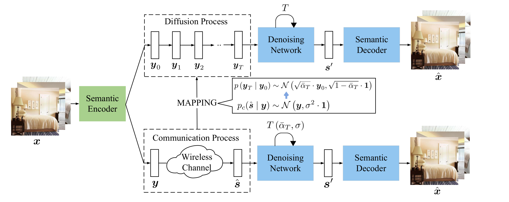
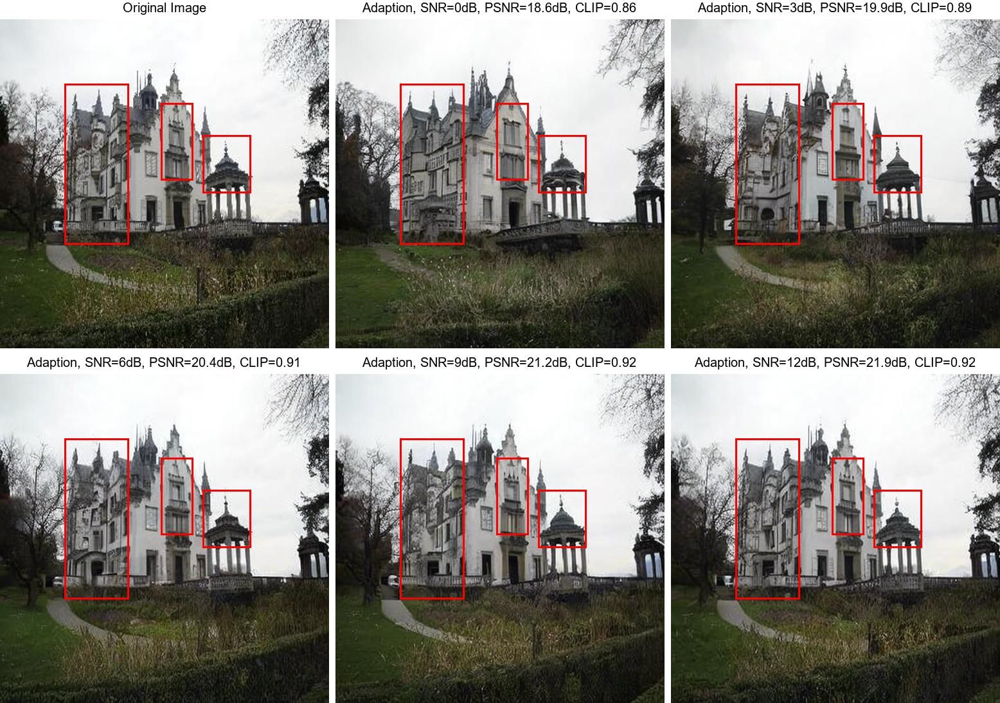

# Diffusion-Driven Semantic Communication

This repository provides the official implementation of **Diffusion-Driven Semantic Communication**,  a framework for semantic communication that leverages generative diffusion models.

## 🔍 Overview

In this system, the wireless channel noise is **explicitly modeled as the forward process** of a diffusion model, while the decoder corresponds to the reverse denoising process.

To handle received signals with non-Gaussian distributions, the framework **transforms them into Gaussian-distributed noise** using several Gaussianization methods (e.g., equalization, SVD decomposition).  

Then, according to the channel condition, the **signal-to-noise ratio (SNR)**, the system maps the received signals to an appropriate step in the diffusion model's forward process.  
This step is implemented in the Function **stochastic_encode_according_snr**.

By bridging the wireless channel noise with the diffusion process, the framework can effectively reconstruct high-fidelity semantic information.

## 🖼 Architecture

<p align="center">
  
</p>

This diagram illustrates:
- Wireless channel as part of the diffusion forward process
- Gaussianization of received signals
- Adaptive SNR-based encoding
- Reverse denoising and semantic reconstruction

---

## 📊 Results

<p align="center">
  
</p>

Example results on semantic reconstruction tasks under different bandwidth and SNR conditions.

When the SNR is low, the semantic information of the image can be correctly transmitted, and as the SNR increases, more details can be recovered.
Noticeably different regions, highlighted with red boxes, are used for clear comparison to demonstrate how improved SNR contributes to more detailed reconstruction.

## ✨ Features

- Theoretical framework for Gaussianization of received signals
- Channel simulation modules (e.g., AWGN, Rayleigh fading)
- Semantic reconstruction using diffusion models
- Plug-and-play training and evaluation in diffusion.

## 🚀 Installation & Quick Start

```bash
pip install -r requirements.txt

python scripts/img2img_with_wireless_channel.py --ckpt v2-1_512-ema-pruned.ckpt --config configs/stable-diffusion/v2-inference.yaml  --strength 0.5 --ddim_step 400 --scale 0 --dataset bedroom --n_samples 4 --outdir bedroom/
```

## 🤝 Acknowledgements
We would like to thank the **Stable Diffusion** open source community for providing code and model support, which inspired part of the diffusion backbone in our implementation.

## 🧠 Citation

If you use this code in your research, please cite:

@ARTICLE{10945983,
  author={Guo, Lei and Chen, Wei and Sun, Yuxuan and Ai, Bo and Pappas, Nikolaos and Quek, Tony Q. S.},
  journal={IEEE Transactions on Wireless Communications}, 
  title={Diffusion-Driven Semantic Communication for Generative Models with Bandwidth Constraints}, 
  year={2025}}
